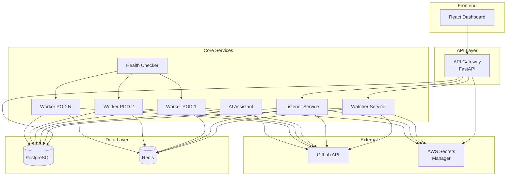

# Merge Assist - Complete Learning and Development Guide

## Table of Contents

1. [Introduction](#introduction)
2. [Architecture Overview](#architecture-overview)
3. [Prerequisites & Environment Setup](#prerequisites--environment-setup)
4. [Part 1: Database Design](#part-1-database-design)
5. [Part 2: Authentication & Authorization](#part-2-authentication--authorization)
6. [Part 3: Secrets Management](#part-3-secrets-management)
7. [Part 4: GitLab API Integration](#part-4-gitlab-api-integration)
8. [Part 5: Microservices Development](#part-5-microservices-development)
9. [Part 6: Frontend Development](#part-6-frontend-development)
10. [Part 7: Deployment & Infrastructure](#part-7-deployment--infrastructure)
11. [Testing Strategy](#testing-strategy)
12. [Study Resources](#study-resources)

---

## Introduction

This guide teaches you how to build Merge Assist—a GitLab MR automation tool—from scratch. You'll learn:

- **Database design** for multi-tenant applications
- **Authentication & Authorization** with JWT and RBAC
- **Secrets management** for production systems
- **Microservices architecture** with Python/FastAPI
- **React frontend** with TypeScript
- **Kubernetes deployment** on AWS EKS
- **Infrastructure as Code** with Terraform

### Learning Approach

Each section follows this structure:
1. **Concept**: What you're building and why
2. **Prerequisites**: Knowledge/tools needed
3. **Step-by-Step**: Implementation guide
4. **Best Practices**: Production considerations
5. **Exercises**: Extend the functionality

---

## Architecture Overview

### System Components



### Data Flow

1. **MR Discovery**: Watcher polls GitLab OR Listener receives webhooks
2. **Validation**: Worker POD validates MR (pipeline, approvals, labels)
3. **Merging**: Single MR or batch merge based on configuration
4. **Monitoring**: Health checker ensures PODs are healthy
5. **Visualization**: Frontend displays real-time status

---

## Prerequisites & Environment Setup

### Required Knowledge

- **Python**: Intermediate (async/await, type hints, decorators)
- **SQL**: Basic (SELECT, INSERT, JOIN)
- **REST APIs**: Understanding of HTTP methods and status codes
- **Docker**: Basic container concepts
- **Git**: Version control basics

### Tools Installation

#### 1. Python 3.10+

```bash
# macOS
brew install python@3.10

# Verify
python3 --version
```

#### 2. PostgreSQL

```bash
# macOS
brew install postgresql@13
brew services start postgresql@13

# Create database
createdb merge_assist
```

#### 3. Redis

```bash
# macOS
brew install redis
brew services start redis
```

#### 4. Node.js & npm (for frontend)

```bash
# macOS
brew install node@18

# Verify
node --version
npm --version
```

#### 5. Docker Desktop

Download from [docker.com](https://www.docker.com/products/docker-desktop)

#### 6. kubectl & minikube (for local K8s)

```bash
brew install kubectl minikube

# Start minikube
minikube start
```

### Project Setup

```bash
# Create project directory
mkdir merge-assist-tutorial
cd merge-assist-tutorial

# Create Python virtual environment
python3 -m venv venv
source venv/bin/activate

# Install dependencies
pip install \
    fastapi \
    uvicorn \
    sqlalchemy \
    psycopg2-binary \
    alembic \
    python-jose[cryptography] \
    passlib[bcrypt] \
    python-gitlab \
    redis \
    boto3 \
    cryptography \
    aiohttp \
    pytest \
    pytest-asyncio
```

---

## Part 1: Database Design

### Concept: Multi-Tenant Database Schema

**Goal**: Design a database that supports multiple GitLab projects, users with different roles, and audit trails.

### Key Principles

1. **Normalization**: Avoid data duplication
2. **Referential Integrity**: Use foreign keys
3. **Indexing**: Speed up frequent queries
4. **Timestamps**: Track creation/modification

### Step 1: Design Entity Relationships

Draw an ER diagram on paper:

- **Users** ↔ **Roles** (many-to-many via `user_roles`)
- **Users** ↔ **Projects** (many-to-many via `project_permissions`)
- **Projects** ↔ **MergeRequests** (one-to-many)
- **MergeRequests** ↔ **MergeHistory** (one-to-many)

### Step 2: Create Schema File

Create `backend/database/schema.sql`:

```sql
-- Example: Users table
CREATE TABLE users (
    id UUID PRIMARY KEY DEFAULT uuid_generate_v4(),
    username VARCHAR(100) UNIQUE NOT NULL,
    email VARCHAR(255) UNIQUE NOT NULL,
    password_hash VARCHAR(255) NOT NULL,
    is_active BOOLEAN DEFAULT true,
    created_at TIMESTAMP WITH TIME ZONE DEFAULT CURRENT_TIMESTAMP,
    updated_at TIMESTAMP WITH TIME ZONE DEFAULT CURRENT_TIMESTAMP
);

-- Add index for fast lookups
CREATE INDEX idx_users_username ON users(username);
```

**Why UUID?** Universally unique IDs prevent conflicts in distributed systems.

**Why TIMESTAMP WITH TIME ZONE?** Correctly handles time across different timezones.

### Step 3: Create SQLAlchemy Models

Create `backend/database/models.py`:

```python
from sqlalchemy import Column, String, Boolean, DateTime
from sqlalchemy.dialects.postgresql import UUID
from sqlalchemy.ext.declarative import declarative_base
import uuid
from datetime import datetime

Base = declarative_base()

class User(Base):
    __tablename__ = 'users'
    
    id = Column(UUID(as_uuid=True), primary_key=True, default=uuid.uuid4)
    username = Column(String(100), unique=True, nullable=False, index=True)
    email = Column(String(255), unique=True, nullable=False, index=True)
    password_hash = Column(String(255), nullable=False)
    is_active = Column(Boolean, default=True)
    created_at = Column(DateTime(timezone=True), default=datetime.utcnow)
    updated_at = Column(DateTime(timezone=True), default=datetime.utcnow, onupdate=datetime.utcnow)
```

### Best Practices

✅ **Use UUIDs** for distributed systems
✅ **Add indexes** on columns used in WHERE clauses  
✅ **Use enums** for status fields to prevent typos
✅ **Soft delete** instead of hard delete (add `deleted_at` column)  
✅ **Audit trails** via separate history tables

### Exercise

**Task**: Add a `teams` table and relate it to `users` (many-to-many). Each team can have multiple users, and users can belong to multiple teams.

---

## Part 2: Authentication & Authorization

### Concept: Secure User Authentication with JWT

**JWT (JSON Web Token)**: Stateless authentication where the server doesn't store session data. The token contains user info and is signed to prevent tampering.

### Step 1: Password Hashing

**Never store plaintext passwords!** Use bcrypt for secure hashing.

```python
from passlib.context import CryptContext

pwd_context = CryptContext(schemes=["bcrypt"], deprecated="auto")

def hash_password(password: str) -> str:
    return pwd_context.hash(password)

def verify_password(plain_password: str, hashed_password: str) -> bool:
    return pwd_context.verify(plain_password, hashed_password)
```

**Why bcrypt?** It's slow by design, making brute-force attacks impractical.

### Step 2: Create JWT Tokens

```python
import jwt
from datetime import datetime, timedelta

SECRET_KEY = "your-secret-key"  # Store in environment variable!
ALGORITHM = "HS256"

def create_access_token(data: dict) -> str:
    to_encode = data.copy()
    expire = datetime.utcnow() + timedelta(minutes=30)
    to_encode.update({"exp": expire})
    
    return jwt.encode(to_encode, SECRET_KEY, algorithm=ALGORITHM)
```

### Step 3: Verify Tokens

```python
def verify_token(token: str) -> dict:
    try:
        payload = jwt.decode(token, SECRET_KEY, algorithms=[ALGORITHM])
        return payload
    except jwt.ExpiredSignatureError:
        return None  # Token expired
    except jwt.InvalidTokenError:
        return None  # Invalid token
```

### Step 4: RBAC (Role-Based Access Control)

Define roles and permissions:

```python
from enum import Enum

class Role(str, Enum):
    ADMIN = "admin"
    PROJECT_OWNER = "project_owner"
    VIEWER = "viewer"

class Permission(str, Enum):
    MANAGE_USERS = "manage_users"
    VIEW_PROJECT = "view_project"

# Map roles to permissions
ROLE_PERMISSIONS = {
    Role.ADMIN: {Permission.MANAGE_USERS, Permission.VIEW_PROJECT},
    Role.VIEWER: {Permission.VIEW_PROJECT},
}
```

### Step 5: Protect Endpoints with Decorators

```python
from functools import wraps
from fastapi import HTTPException

def require_permission(permission: Permission):
    def decorator(func):
        @wraps(func)
        async def wrapper(*args, **kwargs):
            current_user = kwargs.get('current_user')
            user_roles = current_user.get('roles', [])
            
            # Check if user has permission
            if not has_permission(user_roles, permission):
                raise HTTPException(status_code=403, detail="Permission denied")
            
            return await func(*args, **kwargs)
        return wrapper
    return decorator

# Usage
@require_permission(Permission.MANAGE_USERS)
async def delete_user(user_id: str, current_user: dict):
    # Only admins can reach this
    pass
```

### Best Practices

✅ **Short token expiration** (15-30 min for access tokens)  
✅ **Refresh tokens** for longer sessions (7 days)  
✅ **Store JWT secret in environment variables**  
✅ **Use HTTPS** to prevent token interception  
✅ **Implement token revocation** for logout

### Exercise

**Task**: Implement a refresh token endpoint that accepts a refresh token and returns a new access token.

---

## Part 3: Secrets Management

### Concept: Secure Credential Storage

**Problem**: Hardcoding API keys and passwords in code is insecure.

**Solution**: Use a secrets manager (AWS Secrets Manager for production, encrypted files for development).

### Step 1: Abstract Provider Pattern

Create a base class for different secret providers:

```python
from abc import ABC, abstractmethod

class SecretsProvider(ABC):
    @abstractmethod
    def get_secret(self, secret_name: str) -> dict:
        pass
    
    @abstractmethod
    def set_secret(self, secret_name: str, secret_value: dict) -> bool:
        pass
```

### Step 2: AWS Secrets Manager Implementation

```python
import boto3
import json

class AWSSecretsProvider(SecretsProvider):
    def __init__(self, region='us-east-1'):
        self.client = boto3.client('secretsmanager', region_name=region)
    
    def get_secret(self, secret_name: str) -> dict:
        response = self.client.get_secret_value(SecretId=secret_name)
        return json.loads(response['SecretString'])
```

### Step 3: Local Encrypted Files

```python
from cryptography.fernet import Fernet

class LocalSecretsProvider(SecretsProvider):
    def __init__(self, key: bytes):
        self.cipher = Fernet(key)
    
    def get_secret(self, secret_name: str) -> dict:
        with open(f'secrets/{secret_name}.enc', 'rb') as f:
            encrypted = f.read()
        decrypted = self.cipher.decrypt(encrypted)
        return json.loads(decrypted)
```

### Step 4: Unified Manager

```python
class SecretsManager:
    def __init__(self, provider: SecretsProvider):
        self.provider = provider
    
    def get_gitlab_token(self, project_id: str) -> str:
        secret = self.provider.get_secret(f'gitlab/project/{project_id}')
        return secret['token']
```

### Best Practices

✅ **Never commit secrets to Git**  
✅ **Rotate secrets regularly**  
✅ **Use least privilege** (grant minimal permissions)  
✅ **Audit secret access** (log who accessed what)  
✅ **Encrypt secrets at rest and in transit**

### Exercise

**Task**: Add support for Google Cloud Secret Manager as another provider.

---

## Part 4: GitLab API Integration

### Concept: Dual API Approach

Use both custom HTTP client (for fine control) and python-gitlab library (for convenience).

### Step 1: Custom HTTP Client

```python
import aiohttp

class GitLabCustomClient:
    def __init__(self, api_url: str, token: str):
        self.api_url = api_url
        self.headers = {'PRIVATE-TOKEN': token}
    
    async def get_merge_requests(self, project_id: int):
        async with aiohttp. ClientSession() as session:
            url = f'{self.api_url}/projects/{project_id}/merge_requests'
            async with session.get(url, headers=self.headers) as response:
                return await response.json()
```

### Step 2: Python-GitLab Library

```python
import gitlab

class GitLabLibraryClient:
    def __init__(self, api_url: str, token: str):
        self.gl = gitlab.Gitlab(api_url, private_token=token)
    
    def get_merge_requests(self, project_id: int):
        project = self.gl.projects.get(project_id)
        return project.mergerequests.list()
```

### Step 3: Unified Facade

```python
class GitLabUnified:
    def __init__(self, api_url: str, token: str):
        self.custom = GitLabCustomClient(api_url, token)
        self.library = GitLabLibraryClient(api_url, token)
    
    async def get_merge_requests(self, project_id: int):
        try:
            return await self.custom.get_merge_requests(project_id)
        except Exception:
            # Fallback to library
            return self.library.get_merge_requests(project_id)
```

### Best Practices

✅ **Rate limiting**: Respect GitLab's rate limits  
✅ **Retry logic**: Implement exponential backoff  
✅ **Error handling**: Catch and log all exceptions  
✅ **Timeouts**: Set connection and read timeouts

---

## Part 5: Microservices Development

### Watcher Service

**Purpose**: Poll GitLab for new MRs assigned to Merge Assist user.

```python
from apscheduler.schedulers.asyncio import AsyncIOScheduler

class WatcherService:
    def __init__(self, gitlab_client, db, redis):
        self.gitlab = gitlab_client
        self.db = db
        self.redis = redis
        self.scheduler = AsyncIOScheduler()
    
    async def poll_projects(self):
        projects = self.db.get_active_projects()
        for project in projects:
            mrs = await self.gitlab.get_merge_requests(project.gitlab_id)
            for mr in mrs:
                if self.is_assigned_to_us(mr):
                    self.db.upsert_merge_request(mr)
                    await self.redis.publish(f'project:{project.id}', mr.id)
    
    def start(self):
        self.scheduler.add_job(self.poll_projects, 'interval', seconds=300)
        self.scheduler.start()
```

### Listener Service (Webhooks)

```python
from fastapi import FastAPI, Request

app = FastAPI()

@app.post('/webhook/gitlab')
async def gitlab_webhook(request: Request):
    payload = await request.json()
    
    if payload['object_kind'] == 'merge_request':
        mr_data = payload['object_attributes']
        db.upsert_merge_request(mr_data)
        await redis.publish(f'project:{mr_data["project_id"]}', mr_data['id'])
    
    return {'status': 'received'}
```

### Worker POD

Core merge logic (see detailed implementation in `backend/services/worker/`).

---

## Part 6: Frontend Development

### React + TypeScript Setup

```bash
npx create-react-app frontend --template typescript
cd frontend
npm install axios react-router-dom
```

### Login Component

```typescript
import React, { useState } from 'react';
import axios from 'axios';

const Login: React.FC = () => {
  const [username, setUsername] = useState('');
  const [password, setPassword] = useState('');
  
  const handleLogin = async () => {
    const response = await axios.post('/api/auth/login', { username, password });
    localStorage.setItem('token', response.data.access_token);
    window.location.href = '/dashboard';
  };
  
  return (
    <div>
      <input value={username} onChange={e => setUsername(e.target.value)} />
      <input type="password" value={password} onChange={e => setPassword(e.target.value)} />
      <button onClick={handleLogin}>Login</button>
    </div>
  );
};
```

### Protected Routes

```typescript
import { Navigate } from 'react-router-dom';

const ProtectedRoute = ({ children }) => {
  const token = localStorage.getItem('token');
  return token ? children : <Navigate to="/login" />;
};
```

---

## Part 7: Deployment & Infrastructure

### Docker Compose (Development)

```yaml
version: '3.8'
services:
  db:
    image: postgres:13
    environment:
      POSTGRES_PASSWORD: password
      POSTGRES_DB: merge_assist
    ports:
      - "5432:5432"
  
  redis:
    image: redis:7
    ports:
      - "6379:6379"
  
  watcher:
    build: ./backend/services/watcher
    environment:
      DB_HOST: db
      REDIS_HOST: redis
```

### Kubernetes Deployment

```yaml
apiVersion: apps/v1
kind: Deployment
metadata:
  name: watcher
spec:
  replicas: 1
  selector:
    matchLabels:
      app: watcher
  template:
    metadata:
      labels:
        app: watcher
    spec:
      containers:
      - name: watcher
        image: merge-assist/watcher:latest
        env:
        - name: DB_HOST
          value: postgres-service
```

### Terraform (EKS)

```hcl
module "eks" {
  source = "terraform-aws-modules/eks/aws"
  
  cluster_name    = "merge-assist"
  cluster_version = "1.27"
  
  vpc_id     = module.vpc.vpc_id
  subnet_ids = module.vpc.private_subnets
  
  node_groups = {
    workers = {
      desired_capacity = 3
      max_capacity     = 5
      min_capacity     = 1
      instance_type    = "t3.medium"
    }
  }
}
```

---

## Testing Strategy

### Unit Tests (pytest)

```python
def test_hash_password():
    password = "test123"
    hashed = hash_password(password)
    assert verify_password(password, hashed)
    assert not verify_password("wrong", hashed)
```

### Integration Tests

```python
@pytest.mark.asyncio
async def test_gitlab_client():
    client = GitLabCustomClient(api_url, token)
    mrs = await client.get_merge_requests(project_id)
    assert len(mrs) > 0
```

### E2E Tests

```python
def test_complete_merge_workflow(test_gitlab, test_db):
    # Create MR in test GitLab
    mr = test_gitlab.create_mr(...)
    
    # Assign to Merge Assist
    mr.assign(merge_assist_user)
    
    # Wait for worker to process
    time.sleep(10)
    
    # Verify MR was merged
    assert mr.state == 'merged'
```

---

## Study Resources

### Books
- **"Designing Data-Intensive Applications"** by Martin Kleppmann
- **"Flask Web Development"** by Miguel Grinberg (applies to FastAPI too)
- **"Kubernetes in Action"** by Marko Lukša

### Online Courses
- **FastAPI Tutorial**: [fastapi.tiangolo.com](https://fastapi.tiangolo.com/)
- **SQLAlchemy ORM**: [docs.sqlalchemy.org](https://docs.sqlalchemy.org/)
- **React Official Tutorial**: [react.dev](https://react.dev/)

### Documentation
- **GitLab API Docs**: [docs.gitlab.com/ee/api/](https://docs.gitlab.com/ee/api/)
- **PostgreSQL Documentation**: [postgresql.org/docs/](https://www.postgresql.org/docs/)
- **AWS EKS Guide**: [aws.amazon.com/eks](https://aws.amazon.com/eks/)

### Videos
- **System Design Interview Channel**: YouTube
- **TechWorld with Nana**: Kubernetes tutorials

---

## Conclusion

You now have a complete blueprint to build Merge Assist from scratch. Start with the database layer, add authentication, then build services one by one. Each component builds on the previous, so follow the order.

**Remember**: Software development is iterative. Build, test, refactor, repeat.

**Good luck building!** 🚀
