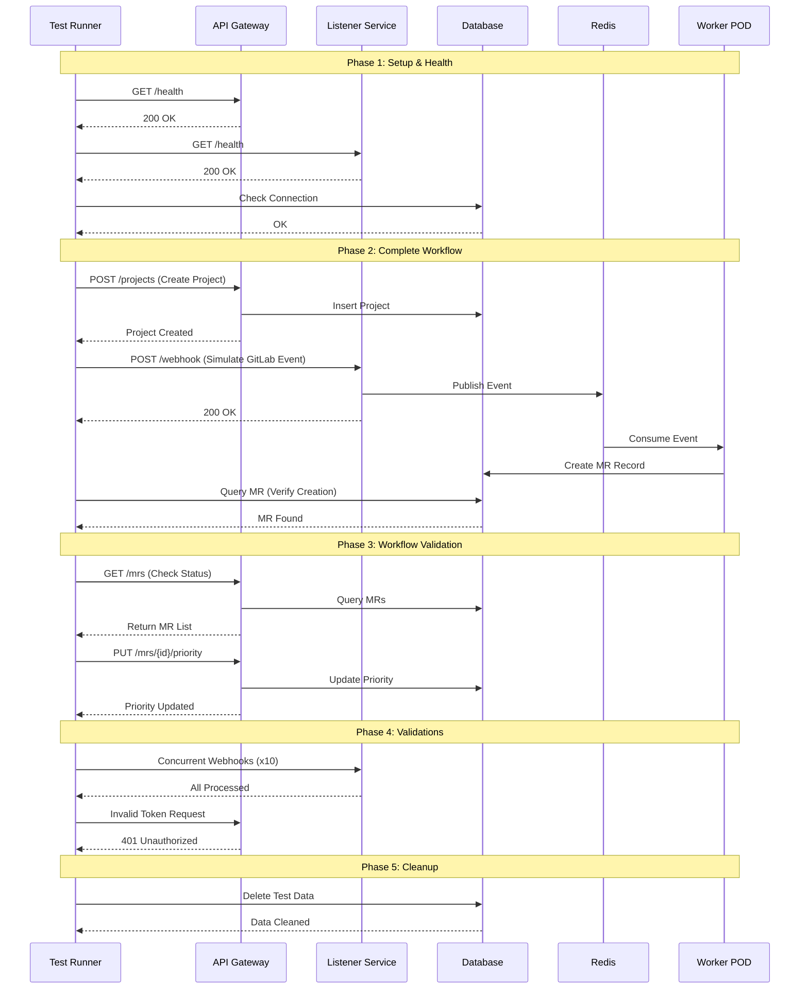

# System Testing Guide

## Overview

System tests validate the **complete Merge Assist application** running with real services (PostgreSQL, Redis, API Gateway, Listener). These tests simulate real-world usage scenarios.

---

## Test Coverage

System tests validate the **complete Merge Assist application** running with real services.

### 🔄 System Test Workflow



System tests cover:

### ✅ **Service Health**
- API Gateway availability
- Listener service availability  
- Database connectivity
- Redis connectivity

### ✅ **Complete Workflow**
1. **Project creation** via API
2. **Webhook processing** (GitLab MR events)
3. **MR validation** logic
4. **Batch merge** simulation
5. **Priority management**
6. **Log retrieval**

### ✅ **Concurrency**
- Multiple concurrent webhooks
- Load handling validation

### ✅ **Error Handling**
- Invalid webhook payloads
- Unauthorized API access
- Invalid authentication tokens

### ✅ **Data Cleanup**
- Automatic test data removal
- Optional GitLab MR cleanup

---

## 👨‍💻 Writing New System Tests

To write new system tests, follow these steps:

### 1. Create a New Test Class
Create a new test class in `tests/system/test_system.py` or a new file in `tests/system/`.

```python
@pytest.mark.system
@pytest.mark.asyncio
class TestNewFeature:
    """Test a new feature in the system."""
    
    async def test_feature_workflow(self, config, http_client, admin_token):
        # 1. Setup data
        payload = {"data": "test"}
        headers = {'Authorization': f'Bearer {admin_token}'}
        
        # 2. Perform action via API or Webhook
        async with http_client.post(
            f"{config.api_url}/new-endpoint",
            json=payload,
            headers=headers
        ) as response:
            assert response.status == 200
            
            # 3. Verify side effects (DB, Redis, etc.)
            # ...
```

### 2. Use Available Fixtures
- `config`: Access values from `.env.system-test`
- `http_client`: Async `aiohttp` session
- `admin_token`: Valid admin JWT token
- `db_session`: Database session for verification
- `redis_client`: Redis client (if needed)

### 3. Add to Test Runner
The default runner executes all tests with the marker `@pytest.mark.system`. Ensure your new test class has this marker.

### 4. Verify Cleanup
If your test creates persistent data that isn't cleaned up by the general cleanup (e.g., new tables or external resources), add a specific cleanup method or fixture.

---

## Prerequisites

### Services Running

```bash
# Start all services
docker-compose up -d

# Verify services
docker-compose ps
curl http://localhost:8000/health  # API Gateway
curl http://localhost:8001/health  # Listener
```

### Test Database

System tests use a **separate test database** to avoid affecting development data:
- Database: `merge_assist_system_test`
- Automatically created by test runner

---

## Setup

### 1. Create Test Configuration

```bash
# Copy example configuration
cp tests/system/.env.system-test.example tests/system/.env.system-test

# Edit configuration
nano tests/system/.env.system-test
```

### 2. Configure Test Environment

**Minimal configuration** (`.env.system-test`):

```bash
# GitLab (use a test project)
GITLAB_URL=https://gitlab.com
GITLAB_TOKEN=glpat-your-token
GITLAB_PROJECT_ID=12345

# Database (separate test database)
DB_HOST=localhost
DB_PORT=5432
DB_USER=merge_assist
DB_PASSWORD=password
DB_NAME=merge_assist_system_test

# Service URLs
API_GATEWAY_URL=http://localhost:8000
LISTENER_URL=http://localhost:8001

# Test users (will be created automatically)
TEST_ADMIN_USERNAME=test_admin
TEST_ADMIN_PASSWORD=SecureTestPassword123
```

### 3. Install Dependencies

```bash
pip install pytest pytest-asyncio aiohttp python-dotenv
```

---

## Running System Tests

### Quick Run (Recommended)

```bash
# Use the test runner script
./tests/system/run_system_tests.sh
```

The runner will:
1. ✅ Check if services are running
2. ✅ Create/setup test database
3. ✅ Run all system tests
4. ✅ Cleanup test data
5. ✅ Display summary

### Manual Run

```bash
# Set Python path
export PYTHONPATH=.

# Run system tests
pytest tests/system/test_system.py -v -s -m system
```

### Run Specific Test Classes

```bash
# Only workflow tests
pytest tests/system/test_system.py::TestCompleteWorkflow -v

# Only concurrency tests
pytest tests/system/test_system.py::TestConcurrency -v

# Only error handling tests
pytest tests/system/test_system.py::TestErrorHandling -v
```

---

## Test Execution Flow

### Phase 1: Setup & Health Checks
```
1. Check API Gateway health
2. Check Listener health
3. Verify database connection
4. Create/verify admin user
```

### Phase 2: Complete Workflow
```
1. Create project via API
2. Process webhook (MR creation)
3. Validate MR logic
4. Simulate batch merge (3 MRs)
5. Test priority management
6. Retrieve and verify logs
```

### Phase 3: Stress Testing
```
1. Send 10 concurrent webhooks
2. Verify all processed successfully
3. Measure response time
```

### Phase 4: Security Testing
```
1. Test unauthorized access
2. Test invalid tokens
3. Test invalid payloads
```

### Phase 5: Cleanup
```
1. Remove test MRs from database
2. (Optional) Delete GitLab test MRs
```

---

## Example Output

```bash
$ ./tests/system/run_system_tests.sh

🧪 Merge Assist - System Test Runner
=====================================

✅ Found system test configuration

🔍 Checking required services...
✅ API Gateway is running
✅ Listener is running

🗄️  Setting up test database...
✅ Database created
✅ Schema applied

📦 Checking test dependencies...
✅ Dependencies ready

🚀 Running system tests...

tests/system/test_system.py::TestSystemSetup::test_services_health 
INFO: ✅ API Gateway is healthy
INFO: ✅ Listener is healthy
PASSED

tests/system/test_system.py::TestSystemSetup::test_database_connection 
INFO: ✅ Database connection successful
PASSED

tests/system/test_system.py::TestCompleteWorkflow::test_01_project_creation 
INFO: ✅ Created project: test-project
PASSED

tests/system/test_system.py::TestCompleteWorkflow::test_02_webhook_processing 
INFO: ✅ Webhook processed successfully
INFO: ✅ MR created in database: !999
PASSED

tests/system/test_system.py::TestCompleteWorkflow::test_04_batch_merge_simulation 
INFO: ✅ Created 3 test MRs for batch merge simulation
INFO: ✅ Found 3 ready MRs for batch merge
PASSED

tests/system/test_system.py::TestConcurrency::test_concurrent_webhooks 
INFO: ✅ Processed 10/10 concurrent webhooks in 1.23s
PASSED

tests/system/test_system.py::TestErrorHandling::test_unauthorized_access 
INFO: ✅ Unauthorized access properly rejected
PASSED

✅ All system tests passed!

📊 Test Summary:
  - Configuration: tests/system/.env.system-test
  - Log file: system_test.log
  - Database: merge_assist_system_test
```

---

## Configuration Options

### Environment Variables

**Required**:
- `GITLAB_URL` - GitLab instance URL
- `GITLAB_TOKEN` - Personal access token
- `GITLAB_PROJECT_ID` - Test project ID
- `DB_*` - Database configuration
- `API_GATEWAY_URL` - API Gateway endpoint
- `LISTENER_URL` - Listener endpoint

**Optional**:
- `TEST_MR_COUNT` - Number of test MRs (default: 5)
- `CLEANUP_AFTER_TESTS` - Auto-cleanup (default: true)
- `CLEANUP_GITLAB_MRS` - Remove GitLab MRs (default: false)
- `WEBHOOK_TIMEOUT` - Webhook timeout in seconds (default: 30)
- `PIPELINE_TIMEOUT` - Pipeline wait timeout (default: 300)
- `LOG_LEVEL` - Logging level (default: DEBUG)

---

## Troubleshooting

### Services Not Running

```bash
# Check service status
docker-compose ps

# Start services
docker-compose up -d

# Check logs
docker-compose logs api-gateway
docker-compose logs listener
```

### Database Connection Failed

```bash
# Verify PostgreSQL is running
docker-compose ps postgres

# Test connection manually
psql -h localhost -U merge_assist -d merge_assist_system_test

# Check credentials in .env.system-test
```

### Tests Failing

```bash
# Run with verbose output
pytest tests/system/test_system.py -v -s --tb=long

# Check specific test
pytest tests/system/test_system.py::TestCompleteWorkflow::test_01_project_creation -v -s

# View logs
tail -f system_test.log
```

### Cleanup Not Working

```bash
# Manual cleanup
psql -h localhost -U merge_assist -d merge_assist_system_test

DELETE FROM merge_requests WHERE title LIKE 'System Test%';
DELETE FROM projects WHERE name = 'test-project';
```

---

## CI/CD Integration

### GitHub Actions Example

```yaml
name: System Tests

on: [push, pull_request]

jobs:
  system-test:
    runs-on: ubuntu-latest
    
    services:
      postgres:
        image: postgres:13
        env:
          POSTGRES_USER: merge_assist
          POSTGRES_PASSWORD: password
          POSTGRES_DB: merge_assist_system_test
        ports:
          - 5432:5432
      
      redis:
        image: redis:7-alpine
        ports:
          - 6379:6379
    
    steps:
      - uses: actions/checkout@v3
      
      - name: Set up Python
        uses: actions/setup-python@v4
        with:
          python-version: '3.10'
      
      - name: Install dependencies
        run: |
          pip install -r requirements.txt
          pip install pytest pytest-asyncio
      
      - name: Start services
        run: |
          docker-compose up -d api-gateway listener
          sleep 10
      
      - name: Configure system tests
        run: |
          cp tests/system/.env.system-test.example tests/system/.env.system-test
          # Configure with test values
      
      - name: Run system tests
        run: ./tests/system/run_system_tests.sh
```

---

## Best Practices

### 1. Use Separate Test Database
Always use `merge_assist_system_test` to avoid affecting development data.

### 2. Mock External Services
For CI/CD, consider mocking GitLab API to avoid depending on external services.

### 3. Cleanup After Tests
Enable `CLEANUP_AFTER_TESTS=true` to ensure clean state between runs.

### 4. Test with Realistic Data
Use real GitLab project for the most accurate validation.

### 5. Monitor Test Performance
Track test duration to catch performance regressions.

---

## System Test vs Other Test Types

| Feature | Unit Tests | Integration Tests | E2E Tests | **System Tests** |
|---------|-----------|-------------------|-----------|-----------------|
| Services | Mocked | Real DB/Redis | All services | **All + Real GitLab** |
| Speed | Fast (ms) | Medium (sec) | Slow (min) | **Slowest (min)** |
| Coverage | Functions | Components | Workflows | **Complete system** |
| Environment | None | Test DB | Docker | **Full deployment** |
| Run Frequency | Every commit | Daily | Before release | **Before release** |

---

## Summary

System tests provide:
- ✅ **Complete validation** of entire application
- ✅ **Real-world scenarios** with actual services
- ✅ **Performance testing** under load
- ✅ **Security validation** of auth and RBAC
- ✅ **Deployment readiness** confirmation

**Run before every production deployment!**

---

*For other test types, see [TESTING.md](../docs/TESTING.md)*
